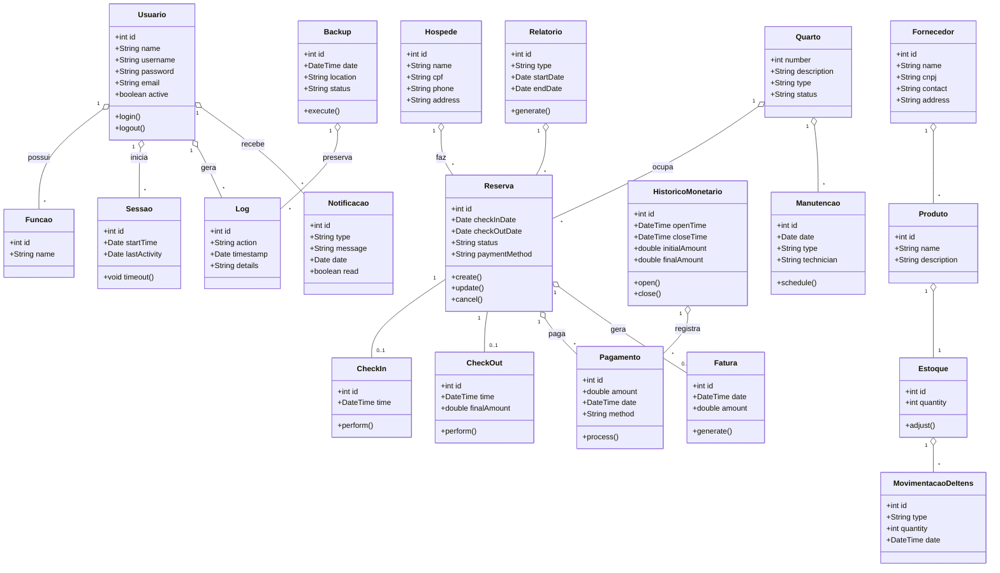

```mermaid
classDiagram

    %% Usuários e Segurança
    class Usuario {
      +int id
      +String name
      +String username
      +String password
      +String email
      +boolean active
      +login()
      +logout()
    }
    class Funcao {
      +int id
      +String name
    }
    class Sessao {
      +int id
      +Date startTime
      +Date lastActivity
      +void timeout()
    }
    class Log {
      +int id
      +String action
      +Date timestamp
      +String details
    }
    class Notificacao {
      +int id
      +String type
      +String message
      +Date date
      +boolean read
    }

    Usuario "1" o-- "*" Funcao : possui
    Usuario "1" o-- "*" Sessao : inicia
    Usuario "1" o-- "*" Log : gera
    Usuario "1" o-- "*" Notificacao : recebe

    %% Hóspedes e Reservas
    class Hospede {
      +int id
      +String name
      +String cpf
      +String phone
      +String address
    }
    class Quarto {
      +int number
      +String description
      +String type
      +String status
    }
    class Reserva {
      +int id
      +Date checkInDate
      +Date checkOutDate
      +String status
      +String paymentMethod
      +create()
      +update()
      +cancel()
    }

    Hospede "1" o-- "*" Reserva : faz
    Quarto "1" o-- "*" Reserva : ocupa

    %% Check-in / Check-out
    class CheckIn {
      +int id
      +DateTime time
      +perform()
    }
    class CheckOut {
      +int id
      +DateTime time
      +double finalAmount
      +perform()
    }

    Reserva "1" -- "0..1" CheckIn
    Reserva "1" -- "0..1" CheckOut

    %% Financeiro
    class HistoricoMonetario {
      +int id
      +DateTime openTime
      +DateTime closeTime
      +double initialAmount
      +double finalAmount
      +open()
      +close()
    }
    class Pagamento {
      +int id
      +double amount
      +DateTime date
      +String method
      +process()
    }
    class Fatura {
      +int id
      +DateTime date
      +double amount
      +generate()
    }

    HistoricoMonetario "1" o-- "*" Pagamento : registra
    Reserva "1" o-- "*" Pagamento : paga
    Reserva "1" o-- "0..1" Fatura : gera

    %% Fornecedores e Estoque
    class Fornecedor {
      +int id
      +String name
      +String cnpj
      +String contact
      +String address
    }
    class Produto {
      +int id
      +String name
      +String description
    }
    class Estoque {
      +int id
      +int quantity
      +adjust()
    }
    class MovimentacaoDeItens {
      +int id
      +String type
      +int quantity
      +DateTime date
    }

    Fornecedor "1" o-- "*" Produto
    Produto "1" o-- "1" Estoque
    Estoque "1" o-- "*" MovimentacaoDeItens

    %% Manutenção e Relatórios
    class Manutencao {
      +int id
      +Date date
      +String type
      +String technician
      +schedule()
    }
    class Relatorio {
      +int id
      +String type
      +Date startDate
      +Date endDate
      +generate()
    }

    Quarto "1" o-- "*" Manutencao
    Relatorio "1" o-- "*" Reserva

    %% Backup e Auditoria
    class Backup {
      +int id
      +DateTime date
      +String location
      +String status
      +execute()
    }

    Backup "1" o-- "*" Log : preserva
```
